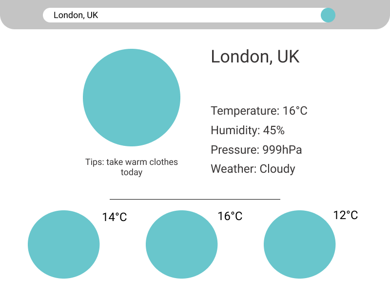

# three-days-forecast
This is a small React project. During learning I've done some configurations:

- [x] Webpack configuration

- [x] babel configuration

## I've learned:

- [x] npm scripts:
what they are and how to use them (before I've only knew how to install packages without thinking about dependencies and devDependencies

- [x] how to write basic React Component
I have learned how build basic React Component, usage of components

Project contains basic react code which can obtain some weather data from weather API. Below I designed how this app should look. In turquoise circles will be weather icons like sun, clouds, rain etc. 

## Still learning:

- [ ] advanced React components

- [ ] usage of Redux

- [ ] styling of components

- [ ] routing 

Wish me luck :)
